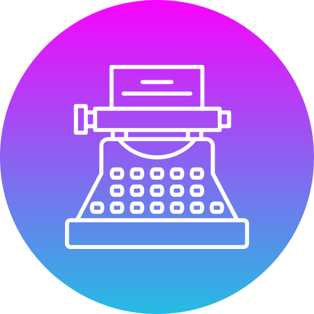

# ascii-art-web-stylize


<!-- PROJECT LOGO -->
<br />
<div align="center">
  <a href="https://gitea.com/almadhoob/ascii-art-web-stylize">
    
  </a>

<h3 align="center">ASCII Art Web Stylized</h3>

  <p align="center">
    A simple text manipulation web app.
    <br />
    <a href="https://gitea.com/almadhoob/ascii-art-web-stylize"><strong>Go to the repo »</strong></a>
    <br />
    <br />
    <a href="https://gitea.com/almadhoob/ascii-art-web-stylize/issues/new?labels=bug&template=bug-report---.md">Report Bug</a>
    ·
    <a href="https://gitea.com/almadhoob/ascii-art-web-stylize/issues/new?labels=enhancement&template=feature-request---.md">Request Feature</a>
  </p>
</div>


<!-- TABLE OF CONTENTS -->
<details>
  <summary>Table of Contents</summary>
  <ol>
    <li>
      <a href="#about-the-project">About The Project</a>
      <ul>
        <li><a href="#built-with">Built With</a></li>
      </ul>
    </li>
    <li>
      <a href="#getting-started">Getting Started</a>
      <ul>
        <li><a href="#prerequisites">Prerequisites</a></li>
        <li><a href="#installation">Installation</a></li>
      </ul>
    </li>
    <li><a href="#usage">Usage</a></li>
    <li><a href="#roadmap">Roadmap</a></li>
    <li><a href="#contributing">Contributing</a></li>
    <li><a href="#authors">Authors</a></li>
    <li><a href="#acknowledgments">Acknowledgments</a></li>
    <li><a href="#license">License</a></li>
  </ol>
</details>


<!-- ABOUT THE PROJECT -->
## About The Project

<!-- <div align="center"></div> -->
<!-- <br /> -->

The ascii-art-web-stylize is a program that is written in Go language using its standard library for the backend (net/http) and  the frontend (html/template) to be excuted as a web server with a web page. It gets two inputs before a submit button, then puts an output in the graphic representation of ASCII code. The first input is a text box that accepts any combination of English letters, Arabic numerals, whitespaces, newlines, and regular special characters only. The second input is a radio button which is the banner name that must be: standard, shadow, xor thinkertoy.

<p align="right">(<a href="#ascii-art-web-stylize">back to top</a>)</p>


### Built With

* [Go programming language](https://go.dev/doc/)
* [Go HTML templates](https://pkg.go.dev/html/template/)
* [Cascading Style Sheets](https://developer.mozilla.org/en-US/docs/Web/CSS/)


<p align="right">(<a href="#ascii-art-web-stylize">back to top</a>)</p>


<!-- GETTING STARTED -->
## Getting Started

To get a local copy up and running follow these simple steps.

### Prerequisites

You only need a web browser (such as Mozilla Firefox) besides the following software:
* Go programming language (v1.22.2 or newer)
    ```sh
    go version
    ```

### Installation

1. Clone the repo
    ```sh
    git clone https://gitea.com/almadhoob/ascii-art-web-stylize.git
    cd ascii-art-web-stylize
    ```

2. Build the app
    ```sh
    go build -o app.run
    chmod +x app.run
    ```

3. Run the app
    ```sh
    ./app.run
    ```

<p align="right">(<a href="#ascii-art-web-stylize">back to top</a>)</p>


<!-- USAGE EXAMPLES -->
## Usage

The program can be used as the following:
```console
go run main.go
```

After that, open the web page through: [http://127.0.0.1:8080](http://127.0.0.1:8080)

<p align="right">(<a href="#ascii-art-web-stylize">back to top</a>)</p>


<!-- ROADMAP -->
## Roadmap

- [x] Add appropriate HTTP status codes.
- [x] Stylise the input form using CSS.
- [ ] Containerise everything in Docker.
- [ ] ...

See the [open issues](https://gitea.com/almadhoob/ascii-art-web-stylize/issues) for a full list of proposed features (and known bugs).

<p align="right">(<a href="#ascii-art-web-stylize">back to top</a>)</p>


<!-- CONTRIBUTING -->
## Contributing

Contributions are what make the open source community such an amazing place to learn, inspire, and create. Any contributions you make are **greatly appreciated**.

If you have a suggestion that would make this better, please fork the repo and create a pull request. You can also simply open an issue with the tag "enhancement".

1. Fork the Project
2. Create your Feature Branch (git checkout -b feature/AmazingFeature)
3. Commit your Changes (git commit -m 'Added some AmazingFeature')
4. Push to the Branch (git push origin feature/AmazingFeature)
5. Open a Pull Request

Don't forget to give the project a star! Thanks again!

<p align="right">(<a href="#ascii-art-web-stylize">back to top</a>)</p>

<!-- AUTHORS -->
## Authors

* Ayoob Aloribi — [Gitea](https://gitea.com/aaloribi)
* Ahmed Almadhoob — [Gitea](https://gitea.com/almadhoob)

<p align="right">(<a href="#ascii-art-web-stylize">back to top</a>)</p>


<!-- ACKNOWLEDGMENTS -->
## Acknowledgments

* Yaman Al-Masri — [LinkedIn](https://bh.linkedin.com/in/yaman-al-masri-1b2108244/)

<p align="right">(<a href="#ascii-art-web-stylize">back to top</a>)</p>


<!-- LICENSE -->
## License

This is an [MIT-Licensed](./LICENSE) project which is created by its authors for [Reboot01](https://reboot01.com/).

<p align="right">(<a href="#ascii-art-web-stylize">back to top</a>)</p>


